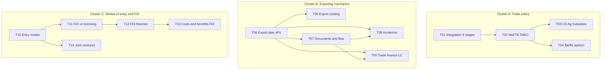

# ADM-11013 — Master Study Map (Partial Exam 2)

**Start here.** This is your navigation hub. The course content is organised into 14 topic files (concept-first, not lecture-first) plus an Exam Priority Index, a Glossary, and an archive of the original per-lecture study notes.

---

## 1. Exam logistics

- **Date:** **April 21st** — Partial Exam 2 (confirmed).
- **Format:** essay-style written answers. No multiple choice. Superficial answers lose points.
- **Scope:** TMEC/USMCA + export topics (costing, plan, documents, Incoterms, letter of credit) + modes of entry + FDI theory. Maps to **topics T01–T14** (Clusters A + B + C below).
- **Teacher promises:** will send an **Incoterms video** and a **letter-of-credit video** before the exam to review. Watch both.

---

## 2. How to use this pack

Recommended reading order:

1. **Skim this map** (5 min) — know the shape of the material.
2. **Read the [Exam Priority Index](Exam%20Priority%20Index.md)** — these are the questions the teacher is most likely to ask.
3. **Work through topics in the order below** — the cluster order (A → B → C) is roughly the class chronology.
4. **Use the [Glossary](Glossary.md)** as a quick reference while reading.
5. **Dive into the [lecture archive](lectures/ADM-11013%20Lecture%2015.md)** only when you need to verify a specific teacher phrasing or revisit the original transcript.

When short on time, prioritise topics marked **HIGH** or **VERY HIGH** in the table below.

---

## 3. Topic map (what to study)

### Cluster A — Trade agreements and trade policy


| #   | Topic                                                                            | Priority | Why it matters                                                                                     |
| --- | -------------------------------------------------------------------------------- | -------- | -------------------------------------------------------------------------------------------------- |
| T01 | [Economic Integration: The 6 Stages](topics/T01%20-%20Economic%20Integration.md) | HIGH     | Teacher flagged "certain to ask"; foundational for everything else                                 |
| T02 | [NAFTA and TMEC / USMCA](topics/T02%20-%20NAFTA%20and%20TMEC.md)                 | HIGH     | Multiple explicit exam flags: rules of origin formulas, tariff schedule, Maquiladora, TMEC changes |
| T03 | [US Agricultural Subsidies](topics/T03%20-%20US%20Agricultural%20Subsidies.md)   | HIGH     | Teacher: "I'm certain to put this on the test"                                                     |
| T04 | [Tariffs: Policy and Opinion Essay](topics/T04%20-%20Tariffs%20Policy.md)        | MEDIUM   | Hill Ch. 7 content; also one of the L22 take-home practice questions (not teacher-flagged as exam) |


### Cluster B — Exporting mechanics


| #   | Topic                                                                                                           | Priority    | Why it matters                                                           |
| --- | --------------------------------------------------------------------------------------------------------------- | ----------- | ------------------------------------------------------------------------ |
| T05 | [Export Costing (direct vs absorption, dumping)](topics/T05%20-%20Export%20Costing.md)                          | MEDIUM–HIGH | Teacher spent a full class on this; bonus-point hint                     |
| T06 | [Export Plan (4Ps framework)](topics/T06%20-%20Export%20Plan%204Ps.md)                                          | HIGH        | Teacher wants students able to build an export plan from scratch         |
| T07 | [Export Documents and 8-Step Flow](topics/T07%20-%20Export%20Documents%20and%20Flow.md)                         | HIGH        | 5 documents + Bill of Lading 3 purposes + 8-step flow — all exam-certain |
| T08 | [Incoterms (E / F / C / D)](topics/T08%20-%20Incoterms.md)                                                      | HIGH        | Teacher will send Incoterms video before exam — strong exam signal       |
| T09 | [Trade Finance: Letter of Credit and Factoring](topics/T09%20-%20Trade%20Finance%20-%20LC%20and%20Factoring.md) | HIGH        | L19: "most likely on the exam… probably on the second exam"; LC video    |


### Cluster C — Modes of entry and FDI


| #   | Topic                                                                                             | Priority  | Why it matters                                                            |
| --- | ------------------------------------------------------------------------------------------------- | --------- | ------------------------------------------------------------------------- |
| T10 | [Modes of Foreign Market Entry (6 modes)](topics/T10%20-%20Modes%20of%20Entry.md)                 | HIGH      | Must be able to list and describe each mode; Maquiladora flagged          |
| T11 | [FDI vs Licensing — Weaknesses of Licensing](topics/T11%20-%20FDI%20vs%20Licensing.md)            | VERY HIGH | Teacher: "This should be written" — 3 weaknesses + 3 industry contexts    |
| T12 | [FDI Theories (Internalization, Knickerbocker, Dunning)](topics/T12%20-%20FDI%20Theories.md)      | VERY HIGH | Silicon Valley question explicitly flagged — must use specific phrases    |
| T13 | [Benefits and Costs of FDI (home vs host)](topics/T13%20-%20Benefits%20and%20Costs%20of%20FDI.md) | HIGH      | L21 flagged: "structure answer in four blocks" — host/home × cost/benefit |
| T14 | [Joint Ventures — Success and Failure](topics/T14%20-%20Joint%20Ventures.md)                      | MEDIUM    | Not independently teacher-flagged; covered in L22 take-home practice      |


---

## 4. Exam-ready quick reference

For each topic, the strongest exam questions are collected in one place:

**→ [Exam Priority Index](Exam%20Priority%20Index.md)** — every `[EXAM]` and `[LIKELY]` flag the teacher has dropped across the course, grouped by priority and linked back to the relevant topic file.

**→ [Glossary](Glossary.md)** — acronyms and specialised terms (FDI, RVC, HCC, LC, FOB, OLI, and 70+ more), organised by theme.

---

## 5. Topic-map visualisation




---

## 6. Cramming path (if you have only a few hours)

Ordered by strength + breadth of the teacher's own exam flags. Topics at the top have the strongest signal (`"certain"`, `"most likely"`, `"this should be written"`); topics at the bottom are practice-only from the L22 take-home and were not flagged as exam material.

**Strongest teacher flags — do these first:**

1. **T11 FDI vs Licensing** — the 3 weaknesses + 3 bad-industry contexts. Teacher: *"This should be written."* Re-flagged in L20 and L21.
2. **T12 FDI Theories** — Silicon Valley explicitly flagged (must use "location-specific advantages" + "externalities"); also compare/contrast the three theories.
3. **T07 Documents & 8-step flow** — 5 documents + 3 Bill of Lading purposes + 8-step flow + HCC. All "exam-certain"; pure memorisation, highest ROI per hour.
4. **T03 US Ag Subsidies** — the 3 subsidies. Teacher: *"I'm certain to put this on the test."*
5. **T01 Economic Integration** — the 6 stages, with one example each. Teacher: *"certain to ask"*; foundational for T02.
6. **T02 NAFTA / TMEC** — rules-of-origin formulas (TV 60 %, NC 50 %), tariff schedule A/B/C/C+, TMEC revisions, Maquiladora. Multiple flags.
7. **T09 Letter of Credit** — the 10-step flow. L19: *"most likely on the exam… probably on the second exam."* Teacher will send a video.
8. **T08 Incoterms** — the 4 groups (E/F/C/D); purpose + what each covers. Teacher will send a video.

**Still flagged but narrower / derivative:**

9. **T13 Benefits & Costs of FDI** — the 2×2 matrix. L21: *"structure answer in four blocks."*
10. **T10 Modes of Entry** — list and describe all 6 modes; Maquiladora flagged.

**Practice-only (L22 take-home — not teacher-flagged for exam, but useful essay practice):**

11. **T14 Joint Ventures** — the GM+SAIC vs. Daimler-Chrysler pair.
12. **T04 Tariffs** — a balanced paragraph drawing on Hill Ch. 7.

Topics **T05 (Export Costing)** and **T06 (Export Plan 4Ps)** can be skimmed if time is tight — important but narrower in likely exam footprint (T05 is mostly calculations; T06 is a long essay with only one explicit flag). Revisit them once the items above are solid.

---

## 7. Mastery path (if you have more time)

Go cluster-by-cluster in order A → B → C, following the chronology above. After each cluster, self-test by trying to answer every `[EXAM]` item from the [Exam Priority Index](Exam%20Priority%20Index.md) for that cluster without looking. The Tier 2 Control Questions make good additional essay practice but are not confirmed exam items.

---

## 8. Foundation recap (Exam 1 material — mostly NOT on this exam)

These topics were covered in the first partial exam and are unlikely to reappear, but occasionally get touched in essay-style answers. Brief recap:

### International balance of payments

- **Balance of Trade** = goods only
- **Current Account** = goods + services + income + unilateral transfers
- **Financial Account** = Capital Account + FDI (assets/liabilities) + Portfolio (assets/liabilities) + Derivatives + Other Investment + Reserves + Errors and omissions
- The overall BoP must balance; non-balance indicates measurement error

### Adjustment mechanisms to a current account surplus

- **External adjustment** (exchange rate): domestic currency revalues → domestic goods become more expensive abroad → exports fall → surplus shrinks
- **Internal adjustment** (prices): money supply rises → domestic prices rise → imports become relatively cheaper → imports rise → surplus shrinks

### Mexico's 2017 BoP snapshot

Current account ~ balanced (~$150M). FDI liabilities $31.7B (inflows), portfolio liabilities $24B. Net ≈ balanced after reserves and errors.

### Protectionist Mexico (pre-1989)

- Import licenses (100% of imports in 1982 → 22% in 1989)
- Tariffs (avg 27% in 1982 → 10.1% in 1989)
- Official price list for imports

Connections: this foundation underpins **T01** (integration stages) and **T02** (NAFTA tariff reduction schedule). Knowing the Mexico 1982→1989 numbers helps contextualise why NAFTA was transformative.

---

## 9. Known unknowns

- **Whether Dunning won a Nobel Prize**: he did not, despite what the lecture transcript says. Do not claim this on the exam.
- **Exact USMCA automotive regional content threshold**: teacher said "higher percentage"; published figure is commonly 75%.
- **Hill textbook edition** page numbers (231 vs 238 vs 249) and figure numbers (Fig. 8.4 vs 8.1) differ. Use topic headings in answers rather than page numbers.

---

## 10. File-system map

```
study-notes/
├── 00 - Master Study Map.md          ← you are here
├── Exam Priority Index.md
├── Glossary.md
├── topics/                           ← 14 topic files (study units)
│   ├── T01 - Economic Integration.md
│   ├── T02 - NAFTA and TMEC.md
│   ├── T03 - US Agricultural Subsidies.md
│   ├── T04 - Tariffs Policy.md
│   ├── T05 - Export Costing.md
│   ├── T06 - Export Plan 4Ps.md
│   ├── T07 - Export Documents and Flow.md
│   ├── T08 - Incoterms.md
│   ├── T09 - Trade Finance - LC and Factoring.md
│   ├── T10 - Modes of Entry.md
│   ├── T11 - FDI vs Licensing.md
│   ├── T12 - FDI Theories.md
│   ├── T13 - Benefits and Costs of FDI.md
│   └── T14 - Joint Ventures.md
└── lectures/                         ← enriched per-lecture notes (archive)
    ├── ADM-11013 Lecture 15.md
    ├── ADM-11013 Lecture 16.md
    ├── ADM-11013 Lecture 17.md
    ├── ADM-11013 Lecture 18.md
    ├── ADM-11013 Lecture 19.md
    ├── ADM-11013 Lecture 20.md
    ├── ADM-11013 Lecture 21.md
    └── ADM-11013 Lecture 22.md
```

